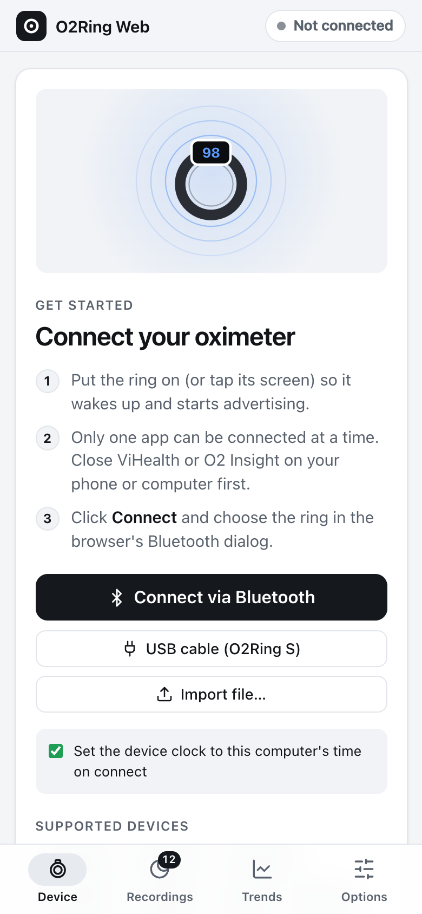
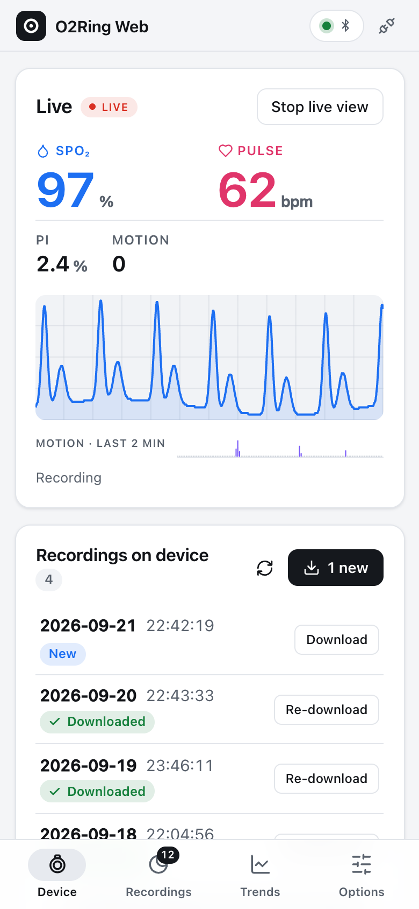
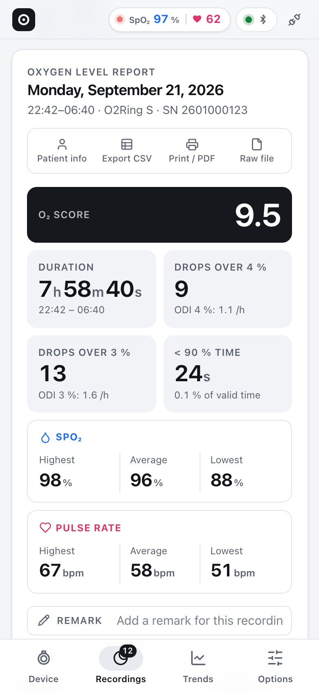
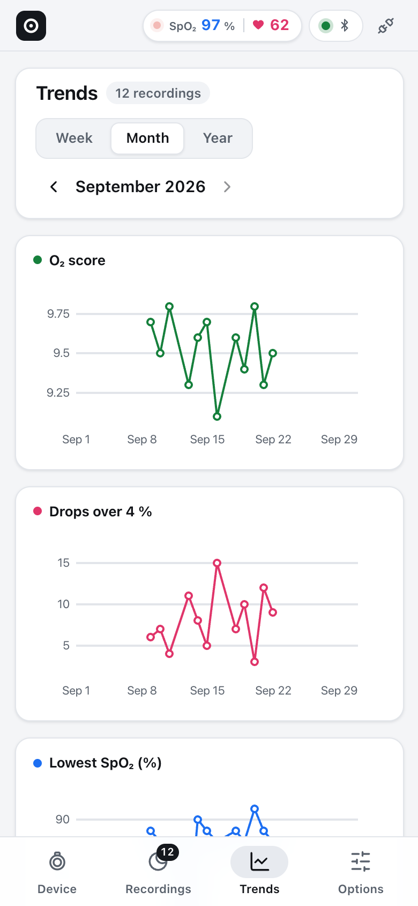

# O2Ring Web

A browser app for most **Wellue / Viatom** sleep oximeters: the **O2Ring S** and the rest of the
Viatom oximeter family (original O2Ring, Checkme O2, SleepU, KidsO2, BabyO2, Oxylink, and
others). It connects over **Bluetooth** (Web Bluetooth) or USB (WebHID, O2Ring S only), downloads
recordings, and shows O2 Insight Pro-style reports. Nothing leaves your browser.

**Open the app: https://khromov.github.io/wellue-o2ring-web-ui/** (Chrome or Edge)

<table>
  <tr>
    <td align="center" width="25%">
      <picture>
        <source media="(prefers-color-scheme: dark)" srcset="docs/images/mobile-1-connect-dark.png">
        
      </picture>
      <br><sub><b>Connect</b></sub>
    </td>
    <td align="center" width="25%">
      <picture>
        <source media="(prefers-color-scheme: dark)" srcset="docs/images/mobile-2-live-dark.png">
        
      </picture>
      <br><sub><b>Live</b></sub>
    </td>
    <td align="center" width="25%">
      <picture>
        <source media="(prefers-color-scheme: dark)" srcset="docs/images/mobile-3-report-dark.png">
        
      </picture>
      <br><sub><b>Report</b></sub>
    </td>
    <td align="center" width="25%">
      <picture>
        <source media="(prefers-color-scheme: dark)" srcset="docs/images/mobile-4-trends-dark.png">
        
      </picture>
      <br><sub><b>Trends</b></sub>
    </td>
  </tr>
</table>

<sub>Screenshots use generated sample nights and a made-up serial number, not real patient data.</sub>

> Unofficial. Not affiliated with Wellue, Viatom or Lepu. Not a medical device.

## Features

- **Connect** over Bluetooth, or over USB for the O2Ring S on its data cable.
- **Device panel**: model, serial, firmware, battery, and device clock (with "Set clock").
- **Live view**: SpO₂, pulse, PI, motion and the pleth waveform.
- **Download recordings**, with progress. Recordings you already have (or removed) are skipped.
  Nothing is ever deleted from the device.
- **Device settings**: SpO₂ and pulse reminders and thresholds, vibration strength, screen mode,
  brightness, storage interval (plus volume on devices with a buzzer).
- **Reports**, following O2 Insight Pro:
  - O₂ score, drops over 3 % / 4 %, ODI, and time below 90 %
  - highest, average and lowest SpO₂ and pulse
  - SpO₂ and pulse duration tables, and the SpO₂ band chart
  - zoomable SpO₂, pulse and motion charts, with ≥ 4 % drop and reminder markers
  - patient info, remarks, print / save as PDF
- **Export**: CSV in O2 Insight Pro's format, or the raw device file.
- **Trends**: week, month or year views of O₂ score, drops, lowest and average SpO₂, and
  average pulse.
- **Import** raw record files, for example files saved earlier or copied from O2 Insight's data
  folder.
- **Backup and restore**: export everything (raw device files, a CSV per recording, remarks,
  patient info and settings) as one ZIP, and restore it into another browser.

See [OMISSIONS.md](OMISSIONS.md) for what's missing compared with the official apps, and
[docs/PROTOCOL.md](docs/PROTOCOL.md) for the protocol and file formats.

## Supported devices

| Family | Devices | Status |
|---|---|---|
| OxyII (`0xA5` frames, service `e8fb0001-…`) | **O2Ring S** | Tested on hardware (BLE: connect, info, settings read, file download, live; USB: info/battery) |
| OxyII | O2Ring SF / SP / SC, S8-AW, Band-WU, SHQO2Pro, O2MP, O2RMed S | Same code path, untested |
| Legacy (`0xAA` frames, service `14839ac4-…`) | O2Ring, Checkme O2 / O2 Max, SleepU, SleepO2, WearO2, Oxylink, KidsO2, BabyO2, OxyRing, OxyU, … | Implemented from the vendor SDK, untested |

## Browser support

Web Bluetooth and WebHID need **Chrome or Edge** on desktop (macOS, Windows, ChromeOS), or Chrome
on Android. On Linux, enable `chrome://flags/#enable-experimental-web-platform-features`.
Firefox and Safari don't support these APIs.

Tips:

- Close ViHealth / O2 Insight first. The ring accepts only one connection at a time.
- Some rings refuse downloads while worn. Take the ring off or put it on the charger.
- A recording's statistics are written about 2 minutes after the ring comes off the finger.

## Development

```sh
npm install
npm run dev     # http://localhost:5173
npm test        # unit tests (protocol codecs, parsers, statistics)
npm run check   # svelte-check + TypeScript
npm run build   # static build in dist/
```

Built with Vite, Svelte 5 and TypeScript. It uses [uPlot](https://github.com/leeoniya/uPlot)
for charts, [idb](https://github.com/jakearchibald/idb) for IndexedDB, and
[@noble/ciphers](https://github.com/paulmillr/noble-ciphers) for AES-ECB, which some OxyII
firmware uses.

Code layout:

```
src/lib/transport/   Web Bluetooth and WebHID byte pipes
src/lib/protocol/    CRC-8, OxyII (0xA5) and legacy (0xAA) codecs and message parsers
src/lib/devices/     device catalogue and per-family sessions (handshake, files, settings, live)
src/lib/files/       record file parsers (O2Ring S and legacy), CSV export
src/lib/analysis/    report statistics and the vendor drop (ODI) algorithm
src/lib/ui/          Svelte components
```

Safety: the session layers only send allow-listed opcodes. Factory reset, firmware, file write
and delete commands can't be sent. Setting changes and clock sync always go through explicit user
actions.

## Deployment

Pushing to `main` builds the app and deploys it to GitHub Pages
(`.github/workflows/deploy.yml`). In the repository settings, set **Pages → Source** to
**GitHub Actions**. The build uses a relative base path, so it works at any Pages URL.

## Credits

The protocol and file formats were worked out by reading Wellue's own apps (ViHealth for Android,
which embeds Lepu's BLE SDK, and O2 Insight Pro for macOS) and checked against a real O2Ring S.
They were cross-checked against community work, especially
[nglessner/o2ring-s-protocol](https://github.com/nglessner/o2ring-s-protocol),
[OSCAR](https://www.sleepfiles.com/OSCAR/)'s Viatom loader,
[SomnoTrace](https://github.com/ilyakruchinin/SomnoTrace) and
[Tepna](https://github.com/Plantucha/Tepna).
